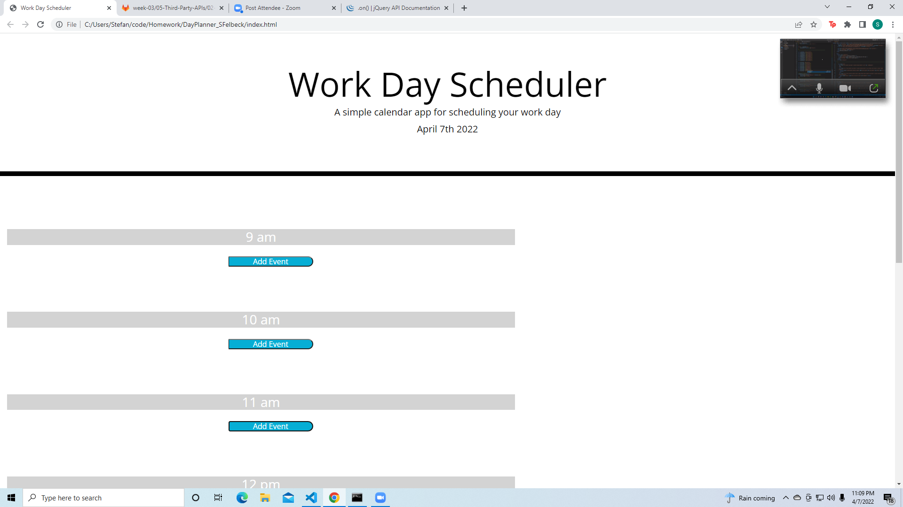

# DayPlanner_SFelbeck

I had a number of stumbles with this assignment, in particular with the save buttons and localstorage, and I found myself relying quite a bit on my classmates and tutors for help with this assignment.
I was given partial code for a dayplanner app and needed to add timeblocks in html. In the Javascript I had to ensure that the timeblocks changed color to reflect the time of day as well as save the value stored in a text space as a saved event unique to that hour.

you can find the application here!

<a href="https://sfelbeck.github.io/DayPlanner_SFelbeck/">You can find the site here</a>