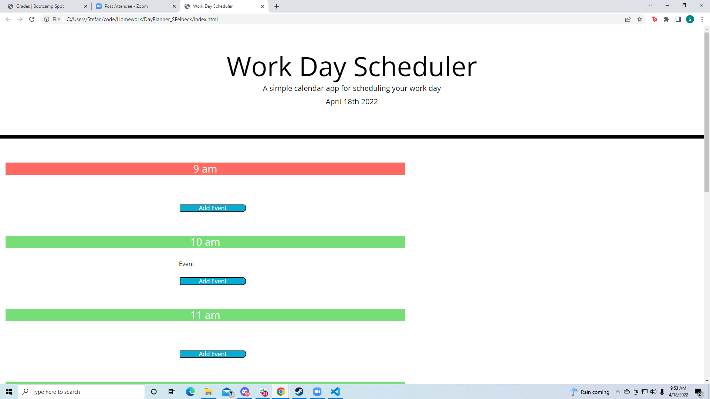

# DayPlanner_SFelbeck

This assignment was far more difficult than I had initially determined it to be, I struggled quite a bit in javascript before a classmate pointed out that we were using jquery and at first that seemed to be a far better solution. However I was unable to finish the user input portion of the assignment. I was able to append list items to the top of the screen with a prompt but ran out of time before I could figure out the remaining steps.
My classmates were extremely useful in the stufy groups however that ultimately could not overcome the relentless march of time.

you can find the current state of the application here

<a href="https://sfelbeck.github.io/DayPlanner_SFelbeck/">You can find the site here</a>